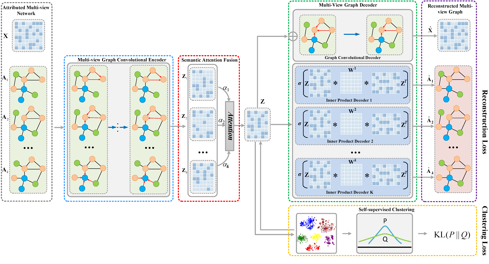

# A2AE
Code for the paper ["A2AE: Towards adaptive multi-view graph representation learning via all-to-all graph autoencoder architecture"](sciencedirect.com/science/article/abs/pii/S1568494622004343)

Sun, Dengdi, Dashuang Li, Zhuanlian Ding, Xingyi Zhang and Jin Tang.["A2AE: Towards adaptive multi-view graph representation learning via all-to-all graph autoencoder architecture"](sciencedirect.com/science/article/abs/pii/S1568494622004343) Applied Soft Computing (2022)，Volume 125, August 2022, 109193.





The base code is a  the dual decoder Graph Auto-Encoder model described in the paper:
 Sun, D., Li, D., Ding, Z., Zhang, X., & Tang, J. (2021). [Dual-decoder graph autoencoder for unsupervised graph representation learning.”](https://www.sciencedirect.com/science/article/abs/pii/S0950705121008261)  *Knowl. Based Syst., 234*, 107564. 

The code in this repo is based on or refers to https://github.com/tkipf/gae,https://github.com/lidashuangok/DGAE , and https://github.com/Jhy1993/HAN/

## Requirements
* TensorFlow (1.0 or later)
* python 3
* networkx
* scikit-learn
* scipy

## Data

In this example, we load  network data (ACM ,DBLP  or IMDB). The original datasets can be found here: https://github.com/Jhy1993/HAN/. 


Preprocessed ACM can be found in:
https://pan.baidu.com/s/1V2iOikRqHPtVvaANdkzROw 
提取码：50k2 

https://bupteducn-my.sharepoint.com/:u:/g/personal/jhy1993_bupt_edu_cn/EfLZcHE2e4xBplCVnzcJbQYBurNVOCk7ZIne2YsO3jKbSw?e=vMQ18v

Preprocessed DBLP can be found in:
https://pan.baidu.com/s/1Qr2e97MofXsBhUvQqgJqDg 
提取码：6b3h  

https://bupteducn-my.sharepoint.com/:u:/g/personal/jhy1993_bupt_edu_cn/Ef6A6m2njZ5CqkTN8QcwU8QBuENpB7eDVJRnsV9cWXWmsA?e=wlErKk

Preprocessed IMDB can be found in:
链接:https://pan.baidu.com/s/199LoAr5WmL3wgx66j-qwaw  密码:qkec


## Run from

```bash
python train_acm.py
```


## Reference

If you make advantage of the A2AE model , please cite the following in your manuscript:

```
@article{SUN2022109193,
title = {A2AE: Towards adaptive multi-view graph representation learning via all-to-all graph autoencoder architecture},
journal = {Applied Soft Computing},
volume = {125},
pages = {109193},
year = {2022},
issn = {1568-4946},
doi = {https://doi.org/10.1016/j.asoc.2022.109193},
url = {https://www.sciencedirect.com/science/article/pii/S1568494622004343},
author = {Dengdi Sun and Dashuang Li and Zhuanlian Ding and Xingyi Zhang and Jin Tang}
}
```